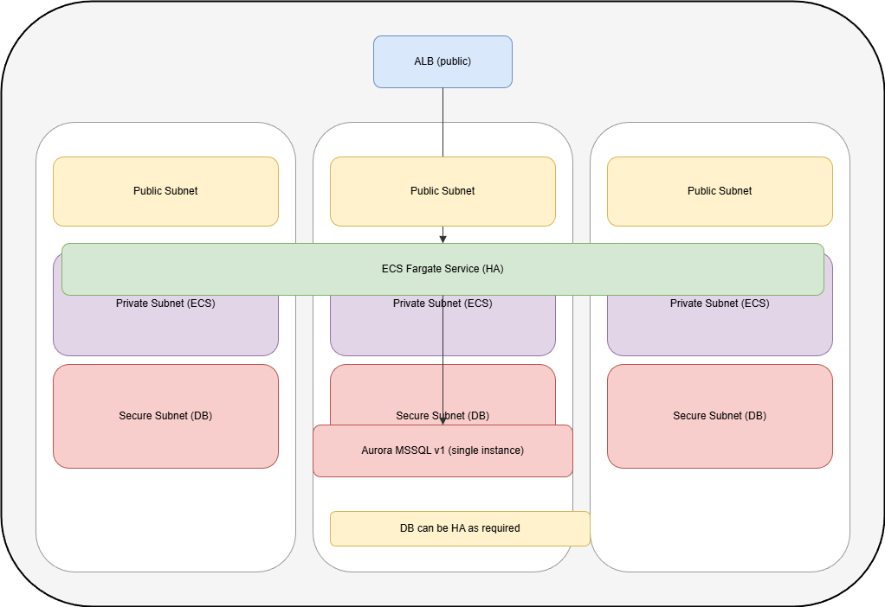

# Take Home DevOps Test - Design Proposal

<!-- markdownlint-disable MD013 -->

## Architecture Diagram

```ascii
# CI/CD Workflow
GitHub Actions / Atlantis (Terraform)
        |               |
        v               v
      ECR       Terraform Platform & Network Stack
```

I've also included a Draw.io architecture diagram to complement the below.

```ascii
# Network architecture diagram
    ALB - Public Subnets
        |
        v
ECS Fargate (Hello Deswik API) - Private Subnets
        |
        v
Aurora MSSQL v1 (private) - Secure Subnets
```



## Brief Explanation

### Core Infrastructure

- Compute: ECS Fargate runs the Hello World C# app without managing servers.
- Networking: VPC with public subnets for the ALB and private subnets for ECS and RDS.
  - This follows the pattern defined in `network/modules/network`.
- Data: Aurora Microsoft SQL Server v1 as the target database.

### Data Migration

- Target store: Aurora MSSQL v1.
- Strategy: Use AWS DMS or native SQL backup/restore to migrate schema and data.
- Validate in parallel, then cut over with a brief maintenance window.

### Security

- Security groups restrict traffic: ALB -> ECS (8080), ECS -> RDS (1433).
- Secrets stored in AWS Secrets Manager for DB credentials.
- ALB uses HTTPS with ACM certs; IAM roles follow least privilege.

### CI/CD Pipeline

- Build container -> push to ECR -> deploy ECS service with a new task definition.
- Terraform plans/applies are managed by Atlantis.
- Note: GitHub OAuth between GitHub and Atlantis is required in practice, but is omitted here for clarity and assumed to be handled from a AWS organisation bootstrapped repo which is not included here.

### Observability

- CloudWatch Logs for ECS tasks and ALB access logs.
- CloudWatch alarms on CPU utilisation and task health.

### Scaling and Centralised Security Monitoring

- ECS service autoscaling based on CPU/memory and ALB request count; scale-out across 3 AZs.
- Aurora scaling via instance class changes and read replicas; use Multi-AZ for HA.
- Centralised security monitoring via GuardDuty and Security Hub in a dedicated audit account, with CloudTrail and ALB logs aggregated to a log archive bucket.

## Implementation Notes (Interview Scope)

- The app returns: "Hello Deswik, we are connected to SQL Server" when the SQL connection is successful.
- The Terraform configuration is runnable but simplified for interview scope and assumes some org-level bootstrapping (e.g., IAM roles and shared services) is handled separately.
- The network layout and CIDR patterns follow the existing `network` module structure.

Please note, this was forked from an existing private repo that I use for my own home lab, hosted in AWS. It uses the full AWS Well Architected pattern with dedicated accounts for:

- Root
- Audit\Observability
- Network Ingress, Egress and Security/Firewall
- Workload accounts
  - Production
  - Dev

My original repo that this was forked from is 3x repos:

- 1x for Terraform bootstrapping my AWS Org
- 1x for Apps
- 1x for control and data plane in K8s
- I use ArgoCD for deploying Kubernetes changes, and Terraform via Atlantis and GitHub Actions for bootstrapping the AWS Organisation and network stacks.

It's very, very overcooked for this interview take home, but it formed the basis of this take home in large part. E.g., I'm still utilising GitHub actions and Atlantis for Terraform CI/CD in this repo.

= = = = = =

## Out-of-the-Box Deployment (Single AWS Account)

If you are not using my AWS Org/SSO setup, the following is the minimal path to deploy:

1. Create an IAM role for GitHub Actions with OIDC trust and permissions for ECR + ECS.
2. Set these GitHub secrets: `AWS_REGION`, `AWS_ACCOUNT_ID`, and `ECS_CLUSTER` if needed.
3. Update `.github/workflows/deploy.yml` with your account ID and role ARN.
4. Deploy `network` then `platform` stacks using Terraform in a single account.
5. PR to `main` to trigger the Docker build, ECR push, and an ECS CodeDeploy workflow to update the app.

## Authenticating against AWS

The AWS Orgs URL for accessing our environment is here: <https://jdtay.awsapps.com/start/#>

Authenticating against an AWS organisation can be done a few ways. Please note, these instructions are generated from a MacBook on an M# series chip. If you were installing these tools on WSL2 or a Linux machine, the steps would largely be the same with the exception of the installation steps.

1. Take access and secret keys from the browser and add them to your shell as environment variables, these are found by logging in to the [AWS Orgs portal](https://jdtay.awsapps.com/start/#)
2. Authenticating using the AWS CLI and configuring SSO
   1. Install the AWS CLIv2 from the [official AWS documentation](https://docs.aws.amazon.com/cli/latest/userguide/getting-started-install.html)
   2. Populate your AWS CLI by running `aws configure sso`
   3. Alternatively copy the [AWS config file](./.aws/config) found in this repo, into your home directory at `~/.aws`
      1. Note: this config file was automatically populated by Granted which I'll talk about below
3. You can also use [Granted](https://docs.commonfate.io/granted/getting-started) to make moving between AWS accounts easier.
   1. The [AWS config file](./.aws/config) found in this repo was programmatically generated using Granted by following these steps:
      1. Install Granted from the [official Granted documentation](https://docs.commonfate.io/granted/getting-started)
      2. Run the following command in your shell `granted sso populate --sso-region ap-southeast-2 https://d-9767760c75.awsapps.com/start/` and follow the prompts.
   2. Run `assume` in your shell of choice and follow the prompts, step by step instructions are also found on [Granted's website here](https://docs.commonfate.io/granted/usage/assuming-roles).
      1. I highly recommend you use Firefox when prompted for a browser of choice, Firefox has the [Granted Browser Extension](https://addons.mozilla.org/en-GB/firefox/addon/granted/) which allows moving between AWS accounts using Firefox Containers with considerable ease
         1. NB: You cannot log in to more than 1x AWS account at a time without using Firefox Containers or Profiles in Chromium based browsers.
         2. Granted uses Firefox containers to split accounts, meaning you can access more than one AWS account at a time in the same browser.
      2. Once completed, run `assume` in your shell and you'll see a TUI to select the AWS Account and Role you require like what's seen below after an OIDC auth flow in your browser as shown here: 
      3. Your AWS Access Key, Secret Key and Session ID are stored in your shell and expire at an appropriate time
      4. To reauthenticate, run `assume` or `assume $AccountName/$PermissionsSet` if you already know the AWS Account and permission set you want to access, e.g., `assume Audit/PowerUserAccess`
   3. To use Assume with Terraform you need to generate the Access and Secret keys into ~/.aws/credentials, you can do this with `--export`
      1. E.g., `assume Staging/PowerUserAccess --export` generates an Access and Secret key for the Staging account and adds them to your `/.aws/credentials` file
      2. To access the account in the console, use `assume Production/PowerUserAccess --c` to access the Staging account console in the browser.

The reason for including these steps for authenticating into AWS is because we need to have valid credentials in our `~/.aws/credentials` file before running Terraform locally. You can populate this credentials file by hand from the AWS Orgs URL, or by running `assume --export` or `assume $AccountName/$PermissionSet --export`, e.g., `assume Audit/PowerUserAccess`.

## Running Terraform Locally

### Prerequisites

1. **Install tfswitch** - Use [tfswitch](https://tfswitch.warrensbox.com/) to manage Terraform versions:

   ```shell
   brew install warrensbox/tap/tfswitch
   ```

2. **Switch to the correct Terraform version** - Run `tfswitch` in any stack directory to automatically select the version specified in the workspace:

   ```shell
   tfswitch
   ```

3. **Install just + gum for TUI workflows** - The stack `justfile` tasks use `gum` to present a TUI for workspace selection when running `just plan` or `just select-workspace`. After this you can run `just init`, and follow the TUI to run plan and applies if your assumed IAM role permits it.

4. **Generate Atlantis config before builds/deploys** - Run `just generate-atlantis` (which calls `scripts/generate-atlantis-yaml.sh`) to produce `atlantis.yaml` from the workspace configs. This should be executed before any build or deploy that relies on Atlantis.

NB: It's very rarely sensible to allow devs to be able to run `terraform apply` locally, these should be controlled using IAM and only allowed to run from a source of truth. E.g., GitHub. For the purpose of this test and my own dev environment, I'm assuming you have Admin access locally and you can push to main. Normal warning here that you should protect your default main branch and only allow PR's that have been reviewed by 1x other a dev at a minimum.

```

## How it works?

----------------

Originally they'd be 5x stacks in total that marry with an AWS Well Architected org with separate workload accounts (e.g., multiple platform stacks in separate accounts, separated at an environment level).

- audit
- baseline
- network
- identity
- platform

For this take home they've been truncated down to 2 so the repo doesn't blow out to hundreds of different files.

- platform
- network
  - These two stacks can be deployed in a single AWS account.

- In each stack (e.g., Platform, Network). You'll find a `workspaces` directory containing YAML configuration files for each unique deployment of the stack
- Run Terraform commands directly:
  - `terraform init` - Initialize the working directory
  - `terraform workspace select $WORKSPACE` - Select the workspace
  - `terraform plan -out=tfplan` - Create an execution plan
  - `terraform apply tfplan` - Apply the changes

When Terraform runs, `_settings.tf` has a local variable called `workspace`, which loads its data from the workspace-named YAML file, see:

```shell
locals {
  workspace  = yamldecode(file("./workspaces/${terraform.workspace}.yaml"))
}
```
